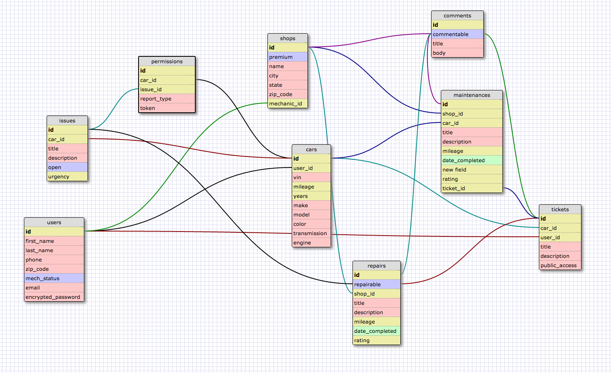

# Auto-biography

## Team Members:
* Marvan Taghvaie
* Mal Wood
* Paula Lee
* Nestor Alvarez

auto-biography is a site that allows the user to create a listing of their cars. They can manually enter pertinent information by themselves or they can enter a VIN, pre-populate the form and then create a listing of their car after their verification.

The user can keep track of the cars' issues and see how many fixes by a mechanic it took for the issue to go away.

auto-biography also allows mechanic users to create shops that will be used to compete in the 'Ticket System.'

The 'Ticket System' allows car users to make requests of car fixes that can be viewed by mechanics in the surrounding area. Mechanics themselves can then comment and have a basic bid for the potential client citing potential fixes and potential prices.

Incoming Features:

* Ticket System
* Location-based ticket system based on zip_code
* Twilio implementation
  * to notify the users of account lockouts
  * to make registered users contact each other
* Venmo implementation
  * for on-the-go payments of mechanic services
  * for the optional sell of a car to another user

